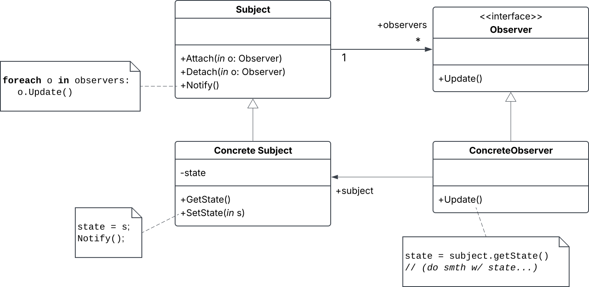
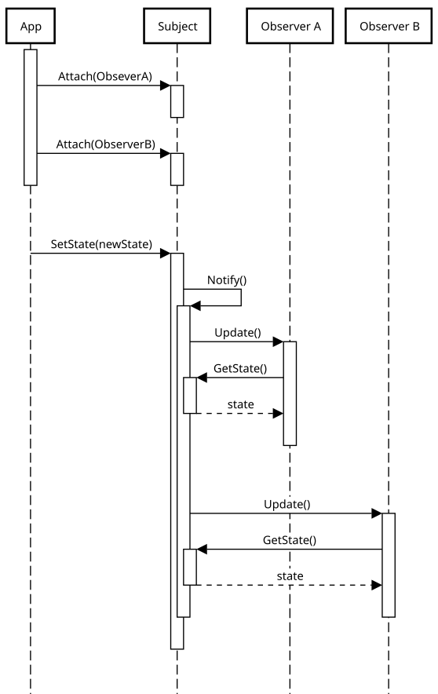

# Observer (Design Pattern)

A.K.A: "Dependents", "Publish-Subscribe".

## Problem

A bunch of objects (observers) need to be notified when some object (subject) changes its state.

- When you partition a system into a collection of cooperating classes, you need some way to **maintain consistency between related objects** in a way that avoids tightly coupling them.
  - e.g., GUI objects that depend on a DB object: When the DB updates, the GUI should, too.


## SOLUTION

- When subject  undergoes a change in state, it notifies its observers. 
  - Crucially, **the subject sends out these notifications *without having to know who its observers are***.
- When an observer receives a notification from its subject, it queries the subject for its new state, which it then acts on.

### Structure



### Collaborations

Here's what the notification publishing would look like between a single concrete subject and two concrete observers.



* An observer itself may also update the state of its subject. Note that in such a scenario, this observer still *waits for an update from the subject* to update its own state.
* `Notify()` is not always called by the subject. In can be called by anything, anywhere.

<!-- 
sequencediagram.org

participant App
participant Subject
participant Observer A
participant Observer B

activate App

  App->Subject: Attach(ObseverA)
  activate Subject
    space
  deactivate Subject

  App->Subject: Attach(ObserverB)
  activate Subject
    space 
  deactivate Subject

deactivate App

space 

App->Subject:SetState(newState)
activate Subject
  Subject->Subject: Notify()
  activate Subject

    Subject->Observer A: Update()
    activate Observer A
      Observer A->Subject: GetState()
      activate Subject
      Subject-\->Observer A:state
      deactivate Subject
      space
    deactivate Observer A

    space

    Subject->Observer B: Update()
    activate Observer B
      Observer B->Subject: GetState()
      activate Subject
      Subject-\->Observer B:state
      deactivate Subject
      space
    deactivate Observer B

  deactivate Subject
  space
deactivate Subject
 -->

### APPLICATIONS

Use the Obs. pattern in any of the following situations:

* An abstraction has two aspects, *one dependent on the other*. 
  * Encapsulating these aspects in two separate objs let you vary & reuse them independently.
* A change in obj requires changing others, and *you don't know how many objs need to be changed*.
* An obj should be able to notify other objs *without making assumptions about who these objs are*.
  * i.e., you don't want these objs tightly coupled.

## CONSEQUENCES

### Benefits

- You can flexibily add/remove Observers to a Subject.
- Subject is not tightly coupled to its Observers.
  - ("Dependency inversion").
  - This allows the Subject & Observers to be in *different layers of abstraction* in your system.
- Supports "broadcast communication".
  - Unlike ordinary requests, the Subject's nofications needn't specify their receiver&mdash;they are broadcast to all objects subscribed to the Subject.

### Cons

- Unexpected updates: A single operation on a Subject may cause a cascade of updates to Observers and their dependent objects.
  - Thus, changing the state of a Subject can be far more expensive than you expect.
- The simple update protocol described above provides no detail on *what* changed in the Subject. With additional protocol to help with this, an Observer may be forced to work hard to deduce its Subject's changes.

## IMPLEMENTATION

### Mapping subjects to their observers

- Simplest way: store references to the Observers in the Subject.
- ^ This may be too expensive when there are many Subjects but few Observers.
  - Solution: Trade space for time by using associative look-up (e.g., hash table).
    - Pro: a Subject w/ no Observers does not incure storage overhead.
    - Con: increases cost of accessing Observers.

### Observing more than one subject

- Some situations demand an Observer depend on more than one Subject. In such cases, the `Update()` interface must be etended to be able to let the Observer know which of its Subjects is sending the notification.
  - This can be achieved simply by adding a parameter to `Update()`.

### Who triggers the update?

Here are two options:

1. Have state-setting operations on *Subject* call `Notify()` after they change the Subject's state.
    - Pro: Clients don't have to remember to call `Notify()` on the Subject themselves.
    - Con: Several consecutive operations will cuase several consecutive updates, which may be inefficient.
2. Make *clients* responsible for calling `Notify()` at the right time.
    - Pro: Client can wait to trigger update until a series of state changes have been made, thus avoiding needless intermediate updates.
    - Con: Adds responsibility to the client, making errors more likely.

### Dangling references to delete Subjects

- You can avoid dangling references in the Observers to their Subject by having the Subject `Notify()` its Observers when it is deleted (e.g., in its destructor).
  - Then, the Observers would reset their references to their Subject.
- What you can NOT do is delete the Observers when the Subject is deleted. Other objects may be referencing the Observers.

### Making sure Subject state is self-consistent before notifs

**A Subject's state must be self-consistent before notifying its Observers, since the Observers query their Subject's state in the course of updating their own state.**

This self self-consistency rule is easy to accidentally violate when a Subject subclass invokes its superclass's operations. For example:

```cpp
void SuperSubject::Operation(int newVal) {
    // ...
    Notify();
}

void SubSubject::Operation(int newVal) {
    SuperSubject::Operation(int newVal);
        // (triggers notification)

    _instanceVar += newVal; // update subclass state---too late!
}
```

One way to avoid this pitfall is to send notifications from *template methods*: The subclass overrides some "primitive method", which the superclass's template method invokes before calling `Notify()`. 

```cpp
void SuperSubject::TemplateMethod(params...) {
    PrimitiveMethod(params...); // overridden in subclasses
    Notify();
}
```

> [!TIP]
> Document which Subject operations trigger notifications.

### Push & pull models (avoiding Observer-specific update protocols)

Different Observers need different information from their Subject. How should you extend the basic `Update()` protocol to allow Observers to get this information? Here's two models, each on opposite extremes:

- **Push model**: Subject sends Observers *detailed* info, whether they want it or not.
  - Pro: Observers only need to make one query to Subject.
  - Con: Increases coupling. This model assumes Subjects know something about their Observers' needs.
- **Pull model**: Subject sends Observers *minimal* info, and it's up to the Observer to thereafter query the Subject for more info.
  - Pro: Emphasizes Subject's ignorance of its Observers.
  - Con: Extra queries from Observers may be inefficient.

### Explicitly specifying modifications of interest

You can improve update efficiency by extending the Subject's *registration* interface (`Attach()`) to allow registering Observers *only for specific events of interest*. Thus, when some event occurs in the Subject, it only notifies Observers that have registered interest in that event.

One way to support this is w/ the notion of **aspects**. Extend `Subject::Attach()` and `Observer::Update()` to take in a parameter that distinguishes what type of event occurred in the Subject:

```cpp
void Subject::Attach(Observer*, Aspect& interest);
void Observer::Update(Aspect& interest); // or Observer::Update(Subject*, Aspect& interest) 
                                         // if the Observer depends on multiple Subjects.
```

### Encapsulating complex update semantics

When the dependency relationshipi btwn Subjects & Observers is particularly complex, an object that mantains these relationships might be required. Such an object is called a **Change-Manager**; its purpose is to *minimize the work required to make Observers reflect a change in their Subject*.

This got pretty complex so I won't make notes of it here. But I will note that a Change-Manager is an instance of the **Mediator pattern**; and because there is typically only one Change-Manager (known globally), the **Singleton pattern** is also often useful.

### Combining Subject & Observer classes

A single object may need to be both a Subject and an Observer. Thus, for languages that don't support multiple inheritance, you generally wouldn't define separate Subject & Observer classes but rather combine their interfaces in one class.
