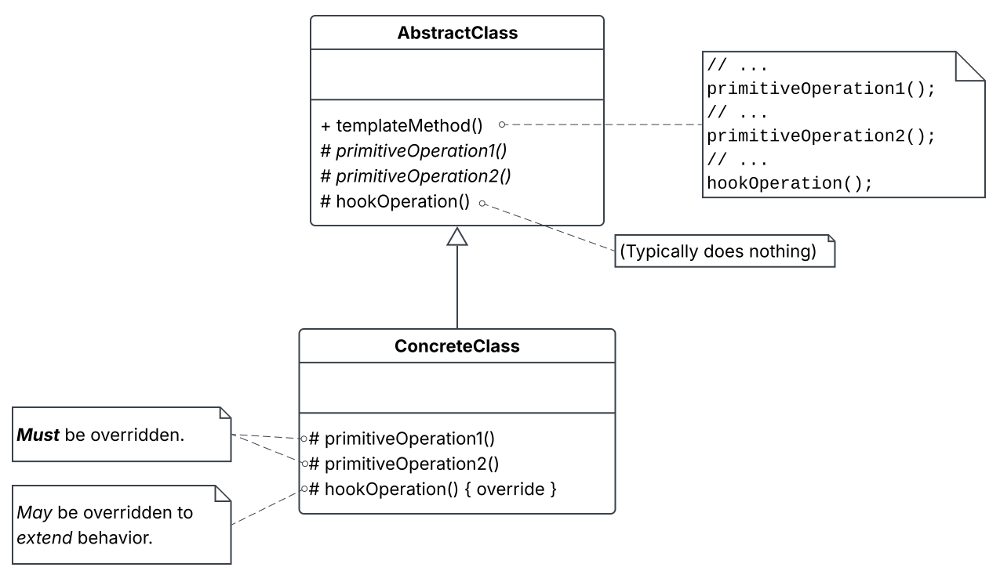

# Template Methods

BIG IDEA: Define the skeleton of an operation in a base class, deferring some of its steps to the subclass. This way, subclasses can redefine certain steps of the operation *without changing the operation's structure*.

Template methods use an *inverted* control structure: a **base class calls its *sub*-class's methods**, not the other way around. This is sometimes referred to as "The Hollywood Principle," that is, "Don't call us, we'll call you."

<!-- ```ts
abstract class Base {
    protected abstract subOp(): any;

    public templateMethod() {
        // ...
        this.subOp();
        // ...
    }
}

class Sub extends Base {
    protected override subOp() {
        // ...
    }
}

const thing = new Sub;
thing.templateMethod();
``` -->



## Example

(TODO)

## Hook Operations

Suppose you want a subclass that extends the behavior of a method it inherits. You could just have it explicitly override its parent's method:

```cpp
void SubClass::operation() {
    ParentClass::operation();
    // extended behavior here...
}
```

Or you could turn that method into a *template* method so that *the parent can decide how its subclasses can extend its functionality*. The idea is to call a **hook operation** inside the template method, and subclasses override *that*.

```cpp
void ParentClass::hook() { /* does nothing */ }

void ParentClass::TemplateOperation() {
    // do stuff...
    hook(); // <-- allows for extended behavior in subclasses
}

void SubClass::hook() override {
    // extended behavior here...
}
```

## Kinds of ops template methods call

* Concrete operations 
  * (either on the ConcreteClass or on client classes).
* Concrete AbstractClass operations 
  * (i.e., operations that are generally useful to subclasses).
* Primitive operations 
  * (i.e., abstract operations).
  * MUST be override in subclasses.
* Factory methods.
* Hook operations.
  * Not required to be overriden by subclasses.

> [!TIP] 
> It's important for template methods to **specify which operations are hooks** (*may* be overriden) and which are **abstract operations** (*must* be overriden).

## Implementation

- *Try to minimize primitive operations*. Remember that a subclass has to override *every* primitive operation a template method calls. The more primitive operations there exists, the more tedious things get for clients.
- *Establish naming conventions identifying operations that must be overridden*. The O'Reilly book gave an example of prefixing primitive ops with "`do`" (`doCreateDocument()`, `doRead()`, etc.).

### C++ access control

In C++ ...

- Primitive ops that have template method calls can be declared `protected` members.
  - This ensures they are only called by the template method.
- Primitive ops that *must* be overridden are declared `virtual`.
- The template method itself should not be overridden, so it should be nonvirtual.
