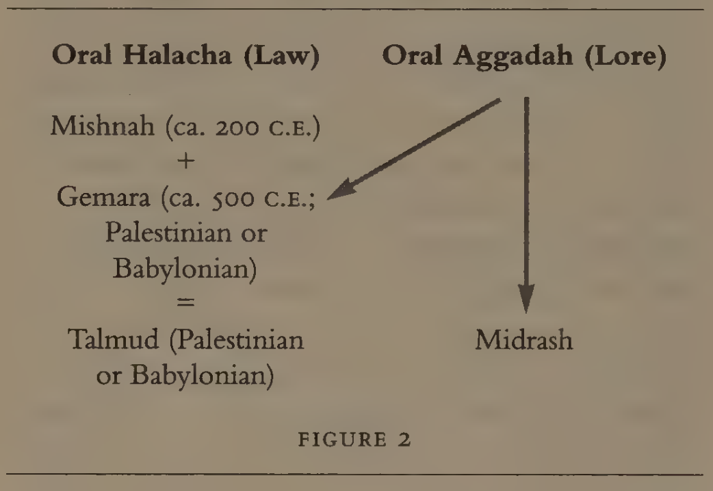

# Judaism (notes for study guide)

## Gaskill Appendix

### Jewish Scripture

Jewish scriptoral canon, in order of authority:

1. *Torah* ("the Law")
    - Composed of the five books of Moses: Genesis, Exodus, Leviticus, Numbers, & Deuteronomy.
    - 248 positive & 365 negative commandments.
2. *Neviim* (prophetic books) and *K'tuvim* (writings (including historical books), wisdom, and literature)

- Altogether, the *Torah* (Law), *Neviim* (Prophets), and *K'tuvim* (Writings) compose the *Tanakh*&mdash;what Christians would call the "Old Testament." 
  - *Tanakh* is the combination fo the first letter of each book. It's also written as **T**a**N**a**K**.
    - This term developed in the Middle Ages and is widely used by European and American Jews, but not traditionally used by academics.
  - Some Jews see *Old Testament* as derogatory, implying their scripture is antiquated or replaced by something "new". Thus, students of religion tend to prefer the term "Hebrew Bible."
  - The *Torah*, *Neviim*, and *K'tuvim* were formally canonized as the entire Jewish *Bible* by a Jewish council in 90 C.E.
    - (It was the "Writings" section that the council ruled on. The "Law" and "Prophets" sections were already accepted.)

Beyond that, Jews have a series of texts that are authoritative but technically noncanonical:

- *Misnah* ("Oral Law")
  - Believed by a "sizeable" % of Jews to have been given to God at the same time he received the written law (*Torah*) on Mt Sinai.
  - Not written down until after "the Christian era" (~200 C.E.), but practicioners nevertheless believe it existed just as long as the written *Torah*.

### Role of scripture in Judaism

- For Orthodox Jews: Part of their daily lives.
  - Regularly read & study its pages, and insights from rabbinic commentators.
- Less strict Jews: Primarily experienced as part of the "liturgy of the synagogue".
- "Statistically speaking, as Judaism becomes more secularized, the practice of reading scripture is not as common in the day-to-day lives of most Jews as it once was."

## *Religions of the World*, Palmer et. all

### Major festivals

#### *Sabbath*

**Start (end?) the week good.**

- "More than Israel has kept the Sabbath, it is the Sabbath that has kept Israel."
- "[The Sabbath's] main effect is to produce release from the world, peace and gaiety in the home, and the lifting of the spirits of those involved in its celebration." 
- "The heights of the Sabbath have enabled Jews throughout the centuries to endure the depths of life the remaining six days of the week."
- There are synagogue services on the Sabbath&mdash;Friday evenings & Saturdays&mdash;but "the heart of the Sabbath lies in the home."
  - No temples, priests, synagogues, or rabbis required. Just a family around a table w/ two candles, two loaves of bread, and (if available) a cup of wine.
- Jewish tradition: "Two angels, one evil and one good, accompany a Jew home from the synagogue on Friday night. If the house is bright & cheerful, the candles lighted and the table laid, the good angel leaves a blessing of happiness on the house, and the evil angel is required to grant a grudging "amen". If, however, the home is not prepared, the evil angel curses the house with a lack of sabbath joy, and the good angel must give a sorrowful "amen"."
- Day of rest.
  - Since God rested on the seventh day of the creation (Gen. 2:1-3, Ex. 20:8-11; 23:12; 34:21).
  - Especially for slaves (Deut. 5:14-15).
  - In event of emergency, all restrictive laws are removed.
  - "Ties together the community's remembrance of two divine events: the creation of the world, and the creation of the Jewish people through the Exodus."

#### *Rosh Hashanah*

**Reject hedonism. Embrace repentance.**

- *Rosh Hashanah* means "Head of the year."
- First day of Jewish new year, falls in Sep. or Oct. (Uses Hebrew lunar calendar.)
- The day in which God remembers each person's deeds, and when God sits in judgement.
  - God's judgements are not final: persons have a 10-day period to rectify their lives & alter those judgements.
- Begins w/ High Holy Days (i.e. Days of Awe), then ten days later culminates in *Yom Kippur* (the Day of Atonement).
  - Days of Awe: Introspection and repentance.
- **Central symbol: *shofar*** ("ram's horn"), a trumpet.
  - (originally warned Israel of an impending threat, or called Israel together for peaceful assembly).
  - Blown 100 times on Rosh Hashanah, calling Jews to self-examination and repentance.

#### *Succoth*

**Yay water and nature! (Or something.)**

The Feats of Tabernacles. 

- Five days after Yom Kippur (the final day of *Rosh Hashanah*).
- Remembrance of Israel's 40 years wandering the wilderness, and how God took care of them.
- **Central symbol: *sukkah***, "booth" or "tabernacle".
  - Families are to construct a *sukkah* outside their home "directly under the heavens" (sky? idk).
    - (Or share one with another family.)
  - Decorated, eaten in, and slept in (when possible).
- Seventh day: *Hoshana Rabba* (Great Hosanna). 
- Eight day: *Shemini Atzeret* (Eight Day of Solemn Assembly). Separate and fully holy. Prayers for rain are said.
- "A custom amongst certain Jewish communities
is to “invite” one of seven biblical figures for each
day of the festival—**Abraham, Isaac, Jacob, Moses,
Aaron, Joseph, and David**. In the Kabbalistic (mysti-
cal) tradition they are identified with seven charac-
teristics—loving kindness, power, beauty, victory,
splendor, foundations, and sovereignty."

#### *Passover*

Spring festival. (The previous three are Fall festivals.)

**Remembering the Exodus from Egypt.**

- Seven days. Begins on the 15th day of the month Nisan.
- Celebrates the Exodus from Egypt.
- The "Festival of Unleavened Bread": Bible commands that no leaven be eaten (or even present in the home) for all of Passover. This is in rememberance of how the ancient Israelites fled Egypt at midnight before their dough could rise.
  - Requires clearing pantry & cleansing utensils as well.
    - Many traditional Jewish homes use preparation for Passover as a "spring cleaning".
  - Night before Passover: special ceremony to search & eliminate last remnants of leaven.
- *seder* ("order"): the Passover meal.
  - Used to be in the temple, but continues despite the temple's fall.
  - During this time, a cup of wine is set out for Elijah, and the door is left opened. This symbolizes the hope for his arrival to herald the Messiah and demonstrates that Israel has no fear of its enemies.
  - *hagaddah*: telling the story of Passover. Addresses the four questions the youngest child asks in keeping w/ a commandment in the Torah ("And you shall tell your son on that day, saing..." which appears 4 times). As these questions are answered, the story of God's deliverance from Egyptian bondage is told.
    - *hagaddah* is central to the Passover b/c the Passover is a teaching tool.
  <!-- - Three obligatory foods: bitter herbs, three pieces of unleavened bread (*mazzah*), and four cups of wine. -->
- The first night commemorates the angel of death taking the Egyptians' firstborns on Israel's last night in Egypt.

### Minor Festivals

(Not prescribed in the Torah.)

#### *Purim*

**Celebrates preservation of Jewish people in times of anti-Semitism**.

- Rooted in Esther's story. 
- One of the happiest holidays.
- Minor holiday (work is permitted).
- All are commanded to come to the reading of Esther in the synagogue (*megillah*).
  - Every time Haman (the bad guy, tried to genocide Jews) is mentioned, the synagogue explodes into boos & hisses.
- Give at least 2 gifts to the poor, and one of 2 kinds of food to at least one friend.

#### *Hanukkah* 

- Rooted in *Antiochus IV* of Syria's persecution of the Jews.
  - Forced Jews to replace their Jewish customs with Hellenistic customs, in order to "remove Jewish resistance".
    - Polluted temple, ordered destruction of Torah scrolls, banned Sabbath observance, forbade circumcision, suspended festivals. Violation of any of these things was punished by death.
    - Had the opposite effect: A revolt erupted in 167 BCE, which by 165 BCE had driven the Syrians out of Jerusalem. The temple was cleansed and they relighted its lights, which miraculously burned for 8 days despite them only having been.
- 8 day winter festival.
- **Central element: *menorah***, the 9-branched candle. (The 9th is used to light the other 8, one each day.)
- For Jews in the US particularyl, Hanukkah can provide a Jewish alternative to Christmas.

#### *Fast Days*

Therea re five fast days, two major and three minor, in the Jewish liturgical calendar.

- 2 minor: relate to destruction of two temples.
- 3 major:
  - 10th day of Tevet (usually in Jan): remembers beginning of Babylonian siege against Jerusalem.
  - 7th day of Tammuz (in summer): commemorates first breaching of Jerusalem's walls by the Romans in 70 CE.
  - Fast of Gedaliah (day after Rosh Hashanah): Commemorates the death of the Babylonian-installed Jewish governor Gedaliah, whose assassination (by radical Jews) placed Judah under direct Babylonian control and lost the Jews any semblance of sovereignty.

#### *Modern Days of Remembrance*

There are four:

1. Yom ha-Shoa: Holocaust memorial day. No memorials have been established aside from 2 mins of silence. 
  - Occurs Nisan 27th, btwn mid-Apr and early May.
2. Yom ha-Zikaron: Israel's Memorial Day, in remembrance of those who have fallen on battle. 
  - May 14th.
3. Yom ha-Atzma'ut: Independence Day, celebrating Israeli declaration of independence on May 15, 1948.
  - Interlaced w/ Yom ha-Zikaron.
4. Yom Yerushalayim: Jerusalem Day (the newest holiday). Commemorates the return of Jerusalem to Jewish control as a result of the 1967 war.

### Rites of passage

- **Circumcision** of male children: Performed when they're 8 yrs old (if healthy), an ancient mark of the covenant given to Abraham. The boy's name is also announced.
  - *mohel*: Ritual specialist who does the circumcision.
  - Converts to Judaism must also be circumcised.
  - (Only birth ceremony for girls is announcing their name.)
- **Redemption of the Firstborn**: Performed on the 31st day after the birth of the firstborn son. In ye olden times, the firstborn male was dedicated to God for religious service (Ex. 13:1-2) and so it was required he be redeemed by paying 5 silver shekels (Num. 18:16) to stay in his family. This practice continues, but instead of shikels it's whatever currency in which Jews live.
- **Bar Mitzvah/Bat Mitzvah**: Boys at 13 and girls at 12 become a "son/daughter of the commandment," reflecting the natural onset of puberty.
  - Often celebrated with an elaborate party&mdash;especially in the US.
  - During their ceremony, boys go up and read from the Torah. In Orthodox circles, girls don't, but it's common for girls to do so among Conservative and Reformed Jews.
  - Nowadays, the *bar mitzvah* marks the end of Jewish scriptoral education for many non-Orthodox Jews (most particularly the diaspora (whatever that is)), though theoretically it's supposed to be the start of his true for real beginning of study in Jewish tradition (especially in the Talmud (whatever that is)).
- **Marriage**: There's a bunch for rituals and ceremonies and shih.
- **Death**. Here's what mourners do:
  - Make a small tear in their closing, symbolizing the separation caused by the death.
  - Immediately after the funeral, the deceased's family "sits *shiva*" in their home: for seven days, they sit on low stools receiving visitors.
    - Required upon the death of a parent, sibling, child, or spouse.
    - Daily prayer services normally  held in the synagogue are held in the home where the shiva takes place, during which *kaddish* ("the mourner's prayer") is said.
      - "In effect, these prayers acknowledge God’s
  gift of life and his dominion over life’s commence-
  ment and termination. In addition, these prayers
  force the mourners to be with others, rather than
  isolating themselves. Shiva is discontinued during
the Sabbath."
    - During shiva, the following are prohibited: Shaving, bathing, wearing leather shoes, sexual relations, laundering clothes, going to work (unless it is absolutely essential economically&mdash;and even then only after the third day).
  - The morning period continues to a lesser degree for up to thirty days&mdash;except for the parents, for whom the morning period is one year.
    - During this extended period, attending joyous events (e.g. weddings) is prohibited unless it "invovles one's livelihood. Thus, musicians or caterers might need to break this prohibition."


### Ritual Practices

- **Purity**. Central to Jewish life, especially w/in the context of the home.
  - *mikveh*.
- **Prayer**: Indiviudal and community prayers.
  - *minyan* present before community prayers can be said at synagogue.
  - *tallit* (prayer shawl) worn during morning prayer services, on which are 4 *tzitzit* tassles.
  - *tefillin*&mdash;two leather boxes containing scriptural texts&mdash;are also worn at prayer.
- **Head Coverings**: Indicate respect before God.
  - Orthodox mean wear the skullcap, called *kippah* (Hebrew) or *yarmulka* (Yiddish), throughout the day.
    - Conservative or Reformed Jews may not, though the former usually does wear them in the synagogue.
- **Mezuzah** (Deut. 6): Write commands of the Lord on doorposts. ("Mezuzah" is Hebrew for doorpost.)
  - Some Jews may kiss the mezuzah upon entering a dwelling or room&mdash;or touch it and then kiss their finger.
- **Kosher Diet**: Following dietary laws.
  - *kosher* means "fit", primarily in relation to foods.
  - "While many persons try to rationalize why certain foods are primitted and why others are not, that is not the concern of the biblical laws. The dietary laws relate to discipline and are obeyed because God gave the commands."
  - Followed w/ varying degrees of strictness.
  - (Some of the) RULES:
    - Animals w/ cloven hooves that chew the cud are permitted.
      - But they must be slaughtered in such a way that they feel no pain.
    - Animals (or birds(?)) that eat meat are NOT permitted.
    - Fish w/ scales are permitted, but NOT shellfish.
    - Milk & meat products may NOT be mixed. After eating a meal containing one, a person must wait before eating a meal containing the other.
    - NEUTRAL FOODS (may be eaten with either milk OR meat): fish, fruits, veggies.

### Groups w/in Judaism

**Geological:** *Ashkenazim* from Europe (especially Eastern) and *Sephardim* from Spain or Arab world. Both of these groups are prepresented in Israel & the US.

**Theological:** Ultra-Orthodox (separate themeselves from modern world) to assimilated (given up their Jewish identity to it).

```
Tradition <-------------- - - - - - - - - - - - - - - - - - - - - - - - - - - - - - - --------------> Modernity

Ultra-Orthodox    |   Modern Orthodox     Conservative                          Reformed        |   Assimilated
```

- **Orthodox**: Refuse to bend Jewish tradition to modern views.
  - Don't drive to synagogue.
  - Only men are called up to read the Torah.
  - Men & women sit separately at the synagogue.
- **Conservative**: Believe they are bound by the rituals & laws of the Torah, but it's possible to introduce modern innovations into Jewish life.
  - Minyan is essential for prayers, but can be composed of both male & female.
  - May drive to synagogue.
  - Women may read the Torah, and women may be cantors or rabbis.
  - Men & women sit together at the synagogue.
- **Reformed**: Feel many of traditions are not binding in the modern world.
  - Deny the necessity of a minyan for prayer.
  - Most consider dietary laws flexible.
  - Men & women have equal roles.
  - Synagogue services include organ music and oft appear like a Protestant service.
    - In US, conducted wholly in English.
  - Abolished circumcision for babies and mikveh for converts.
  - Individuals are Jewish if their father is; their mother need not be.

The gap between Reformed Jews and Orthodox/Conservative Jews is large. While Reformed Jews would consider themselves fully Jewish along with Orthodox/Conservative, Orthodox don't tend to see Reformed that way.

- **Ultra-Orthodox**: Try to separate themselves 100% from modern society.
  - In Israel, there's a lot of ultra-orthodox in Jerusalem, and lesser numbers in Tel Aviv and Haifa.
  - Very rare in US.
  - Two main groupings: *Hasidim* and *Mitnagdim*. Initially, the latter was radically opposed to the former, but over time that has dissolved. (Both stood together in opposition to the Enlightenment.)

### Scripture


(Most of the stuff in this section was already covered in the eBook appendix.)

- Oral Torah has two components: the *Halacha*, containing legal discussions (law), and the Aggadah, containing philosophy, theology, legends, & traditions (lore).



In addition to allat, Jewish rabbis and "laypersons" may turn to other bodies of literature:

1. Commentaries, including those written w/ relation to material in the Tanak or Talmudic material.
2. Responsa, in which authors attempt to relate traditional materials to new issues arising within the community.
3. Codes, in which Jewish scholars attempt to accessibly capture the essence of Jewish life.

### Special Focus and Challenges

- "the Jewish people are a peculiar people among the nations. Their purpose is to bear witness to the presence of God in the world. Their dietary laws, their festivals, and the mode of dress for some separate the religious Jews from their neighbors and identify them as a distinct entity that is at variance with many of the world's values and customs. Beause of that uniqueness, they have often been a people upon whom others have chosen to vent their anger and frustration. As a consequence, suffering has been a constant portion in Jewish life through the centuries."
  - e.g., Holocaust. "Jews became the object of German hatred and of Germany's need for a scapegoat for unrealistic demands placed on them by the Allies at the end of the First World War."
    - "Those who survived bore the deep scars of their own suffering, as well as the death and suffering of so many others."
  - Rabbi Rosen: "Wherever there is evil it must try to rid itself of that which bears witness of God. If, in fact, the Jews are God's chosen people, then evil will always find them."
  - For some Jews, the Holocaust is evidence that their God, who is professed to be involved in history, has withdrawn from the world. More universally accepted, however, is Rabbi Rosen's philosophy&mdash;"evil cannot pass by those who witness of God".
- "While the Holocaust was a malignant, vile challenge to Jewish life, a more insidious and perhaps more dangerous threat today comes from a very different problem&mdash;assimilation. The strength of Judaism has always been its uniqueness in the face of the world's values. However, as Jews live in the comfort of the West, where few people ask about religious affiliation, more and more Jews are leaving their heritage and beginning to disappear into the surrounding culture. Sometimes assimilation comes through marriage with a non-Jewish partner. Sometimes it comes because keeping dietary laws or Sabbath regulations is inconvenient. Whatever the reason, Jewish identity is being threatened by the very openness and pluralism of Western society, particularly that which is found in the United States."
- "In the face of the twin challenges of persecution and assimilation, the state of Israel may provide a counterpoint for those who wish to control their own political destinies as well as maintain a Jewish religious lifestyle."

### Women and Families

- The role of women gets broader as you move from tradition (Orthodox) to modernity (Reformed).
- The place in which a Jewish woman has the *least* say about her life is in attaining a divorce:
  - Civil divorce is not enough, you need a religious divorce (*get*).
    - Generally, mutual consent btwn estranged partners is enough for a religious divorce. But in Orthodox tradition, only the man can issue the get.
      - Some men have withheld the get out of bitterness in order to elicit $ from wives and their families. But in these cases, the courts and community can effect sanctions against the husband to persuade him to provide a get.
  - Without a religious divorce, a woman who remarries is considered to be living in adultery.
  - Reformed Judaism has eliminated the need for the get.
  - Conservative Judaism has made issuing a get in the event of a (civil?) divorce required&mdash;it's included in the marriage contract, in fact.

### Jewish Influence Today

- "The influence of the Jewish community has
always exceeded its numbers. The reason probably
lies in the emphasis that Judaism has placed on edu-
cation and hard work. Education provides a legiti-
mate way to rise above the poverty in which many
Jews have had to live. Consequently, those Jews who
have been fortunate enough to have access to educa-
tion have made the best of the opportunities. Judaism
has produced scientists, musicians, writers, physi-
cians, politicians, and researchers in various fields."

#### Israel

- Bro why is this man so political: "More and more diaspora Jews are marrying non-
Jews, which leads to a breakdown of the traditions in
the home and a minimizing of the impact of Judaism
on the children. Thus, even though the largest Jew-
ish community in the world is in the United States,
the future of Judaism does not lie there. Rather, it lies
in the state of Israel, where Judaism, in all its various
forms, is the lifeblood of the nation."
- *Zionism* is the modern movement that formed Israel. Its founding father was Theodore Herzl, though he did not live to see the birth of the state of Israel.
- Not all Jews supported the idea of an independent state. Among these are Jews spanning from Ultra-Orthodox to Reformed.
  - Liberal Jews saw themselves as citizens of the countries in which they lived.
  - Ultra-Orthodox Jews believed the restoration of Israel should be brought about by God, not through political means.
  - "However, after the Holocaust, it became evident that if there was to be any safety for Jews, it would have been to be in their own land. Thus, Jews of many different persuasions support the Zionist cause, although they may look at
the relation between religion and the land differ-
ently than do their neighbors."

### Latter-day Saint Reflections

#### Differences

- "The major difference between Latter-day Saints
and persons who hold the Jewish faith is that Latter-
day Saints, like all other Christians, believe that Jesus
of Nazareth was the Messiah and that he was God
incarnate. Jews do not accept these assertions, in
part because the Messiah is expected to bring an era
of peace, something which has certainly not hap-
pened since Jesus’ day. Also, were Jesus the Messiah,
in Jewish eyes his followers could never have treated
God’s chosen people as they have over the centuries.
The most brutal treatment of Jews has come at the
hands of professed Christians—brutality that culmi-
nated in the “final solution,’ which was accepted by
some Christians and overlooked by many others."
- Jews disagree with us on our understanding of God. For them, God is one. For Latter-day Saints, there is a Godhead composed of the Father and the Son and the HG; each member is divine, and people may stand in relation to each.
- "Jews, as do
Latter-day Saints, believe that God is involved in
human history. However, Latter-day Saints believe
that the ultimate demonstration of God’s involve-
ment in history comes in the incarnation in which
God the Son enters human history, a position with
which no Jew can totally agree."
- Jews believe they are God's chosen people. Latter-day Saints believe God's people is a superset of Jews and also includes those who are adopted into it.
  - LDSaints do not see membership in Israel as committing them to live the Law of Moses.
- LDSaints would say that the moral mandates of the Law are binding, but not the ritual portions&mdash;because they pointed to Christ's atoning sacrifice. "Judaism cannot separate the ritual from the moral, for both are divinely given, and people have no right to pick and choose what commandments they will or will not keep."
- For Jews, anything beyond the Torah is commentary. No new revelation is forthcoming. Meanwhile, for LDSaints the canon is always open; "God may indeed have more to say, providing new knowledge that was not contained in previous revelations."

#### Similarities

- "The first concerns the role of women and the centrality of the
family. Latter-day Saints stand closest to modern
Orthodox Jews on the importance of marriage and
family. The woman’s first role is within the home as
wife and mother. However, she may also fulfill other
roles in the secular world provided the primary role
is not neglected."
  - Ew.
- "The other realm of commonality is that of perse-
cution. Latter-day Saints should have some small
sense of what Jewish suffering has entailed, for
because of their faith they had to flee for their lives
from the midst of a supposedly tolerant society in
order to find freedom of worship."
  - "Like the Jews,
Latter-day Saints are a peculiar people who have set
themselves apart from the societies in which they
live by their stress on the Word of Wisdom and their
moral standards. Like some Jews, they dreamed of a
theocratic state; but when that did not come about,
they immersed themselves in American society,
becoming its leaders in many instances. Like the
Jews, Latter-day Saints have become successful—and
therein lies the danger to Latter-day Saints, just as
surely as it is a danger to American Jewry. "
- "Both communities run the risk of being assimilated slowly and quitly into the fabric of Americanism."
  - Idk I think it's ironic he says this because Mormonism is a very American religion...
  - "As several Latter-day Saint prophets have said, the
church will be tested far more by success and pros-
perity than it ever was by persecution."
  - "Ultimately,
the danger for the future of Latter-day Saints and
Jews alike is to become too much like the nations
and not to be what God has called them to be."
    - "If,
however, they follow the revelations God has given
them, they each in their own ways may become
great witnesses of the God who involves himself in
human history."
